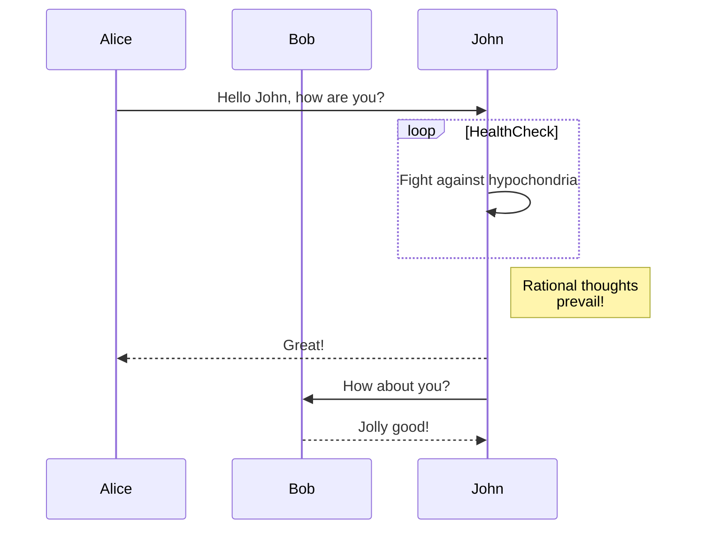
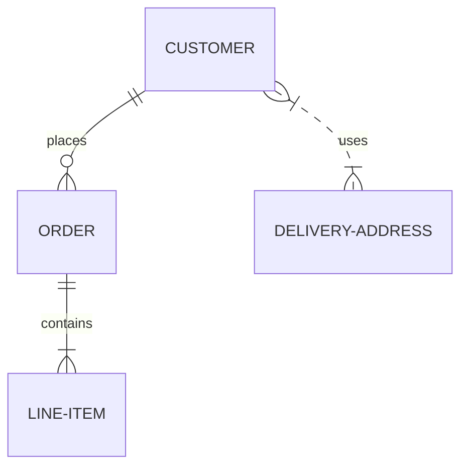
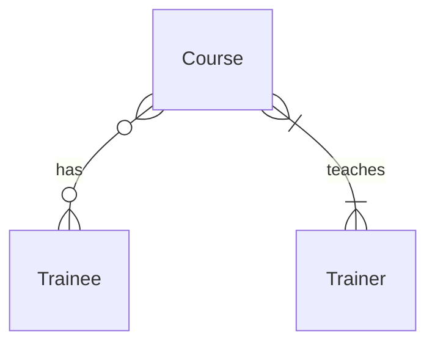

# my-profile
plain text
&nbsp;
yippee

# H1

## H2

### H3

#### H4

##### H5

###### H6

####### H7

*italics*

_also italic_

**bold**

__also bold__


## Github flavoured markdown

My `CustomerService` class uses the `CustomerRepository` for its constructor injection

```sql
SELECT * FROM customers;
```

```java
public static void main(String[] args){
    System.out.println("Hello world");
}
```

```C#
public static void main(String[] args){
    Console.WriteLine("Hello world");
}
```

## Task Lists

- [ ] Do something
- [x] Do something else

## Tables

| Name | Street | Town |
|------|--------|------|
|Nish|Walmey St.|Brum|
|Cathy|123 St|Stafford

## Mermaid

### Graph


### Sequence diagram



### Database Schema



### Sparta Academy Project Database Schema

